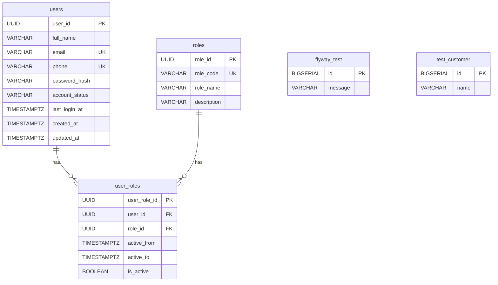

# RepairLink — Complete Project Analysis

> [!NOTE]
> This analysis was produced by reading **every source file** in the project. All findings are confirmed from actual code unless explicitly marked as *inferred*.

---

## 1. Project Structure

```
RepairLink/
├── .env.example              ← empty
├── .github/modernize/        ← Java upgrade config (unused)
├── README.md                 ← empty
├── SETUP.md                  ← empty
├── CONTRIBUTING.md           ← empty
├── database/                 ← .gitkeep only (empty)
├── docs/                     ← .gitkeep only (empty)
├── scripts/                  ← .gitkeep only (empty)
│
├── backend/                  ← Spring Boot 4.1.1 + Java 24
│   ├── .env / .env.example   ← JWT config
│   ├── pom.xml
│   └── src/
│       ├── main/java/com/repairlink/backend/
│       │   ├── BackendApplication.java
│       │   ├── common/
│       │   │   ├── enums/         (AccountStatus, RoleCode)
│       │   │   ├── exception/     (Global handler + 3 custom exceptions)
│       │   │   └── response/      (ApiError record)
│       │   ├── config/            (SecurityConfig, PasswordConfig)
│       │   └── security/auth/
│       │       ├── controller/    (AuthController)
│       │       ├── dto/           (6 records)
│       │       ├── entity/        (UserAccount, Role, UserRole)
│       │       ├── filter/        (JwtAuthenticationFilter)
│       │       ├── handler/       (RestAuthenticationEntryPoint)
│       │       ├── repository/    (3 JPA repositories)
│       │       └── service/       (AuthService, JwtService)
│       ├── main/resources/
│       │   ├── application.properties
│       │   └── db/migration/     (V1–V4 Flyway migrations)
│       └── test/                  (1 empty context-load test)
│
└── frontend/                 ← React 19 + Vite 8 + Tailwind CSS 4
    ├── package.json
    ├── vite.config.js
    ├── index.html
    ├── public/images/         (repairlink-logo.png)
    └── src/
        ├── main.jsx
        ├── App.jsx
        ├── index.css / App.css / styles/index.css
        ├── constants/routes.js
        ├── routes/AppRoutes.jsx
        ├── layouts/           (AppLayout, AuthLayout, MainLayout)
        ├── pages/
        │   ├── auth/          (LoginPage, SignupPage)
        │   └── customer/      (LandingPage, CustomerDashboardPage, ProfilePage)
        ├── components/
        │   ├── common/        (Button, SectionTitle, logo [empty])
        │   ├── forms/         (FormInput, PhoneInput)
        │   └── navigation/    (Navbar)
        ├── features/auth/     (authApi.js)
        ├── utils/             (auth.js, helpers.js)
        └── validation/        (authValidation.js)
```

### Key observations
- **`database/`**, **`docs/`**, **`scripts/`** are scaffolded but completely empty (`.gitkeep` only).
- **`README.md`**, **`SETUP.md`**, **`CONTRIBUTING.md`**, root **`.env.example`** are all empty files.
- The project is organized as a monorepo with separate `backend/` and `frontend/` directories that run independently.

---

## 2. Frontend

### Framework & Build Setup
| Concern | Technology | Version |
|---|---|---|
| UI Library | React | 19.2.8 |
| Build Tool | Vite | 8.2.0 |
| Styling | Tailwind CSS | 4.3.3 (with `@tailwindcss/vite` plugin) |
| Routing | react-router-dom | 7.18.3 |
| Icons | lucide-react | 1.34.0 |
| Linting | ESLint 10 | with react-hooks + react-refresh plugins |

### Entry Points
- [index.html](file:///c:/Users/Swan%20Htet/Desktop/RepairLink/frontend/index.html) → loads [main.jsx](file:///c:/Users/Swan%20Htet/Desktop/RepairLink/frontend/src/main.jsx)
- `main.jsx` wraps `<App>` inside `<BrowserRouter>` and `<React.StrictMode>`
- [App.jsx](file:///c:/Users/Swan%20Htet/Desktop/RepairLink/frontend/src/App.jsx) renders `<AppRoutes />`

### Routing ([AppRoutes.jsx](file:///c:/Users/Swan%20Htet/Desktop/RepairLink/frontend/src/routes/AppRoutes.jsx))

| Path | Component | Auth Required | Status |
|---|---|---|---|
| `/landing` | `LandingPage` (in `MainLayout`) | No | ✅ Implemented |
| `/login` | `LoginPage` | No | ✅ Implemented |
| `/signup` | `SignupPage` | No | ✅ Implemented |
| `/dashboard` | Inline `DashboardPage` | Yes (CUSTOMER) | ⚠️ Minimal — shows "Hello, {name}" |
| `/my-vehicles` | `PagePlaceholder` | Yes (CUSTOMER) | ❌ Placeholder only |
| `/service-request` | `PagePlaceholder` | Yes (CUSTOMER) | ❌ Placeholder only |
| `/appointments` | `PagePlaceholder` | Yes (CUSTOMER) | ❌ Placeholder only |
| `/active-service` | `PagePlaceholder` | Yes (CUSTOMER) | ❌ Placeholder only |
| `/loyalty` | `PagePlaceholder` | Yes (CUSTOMER) | ❌ Placeholder only |
| `/service-history` | `PagePlaceholder` | Yes (CUSTOMER) | ❌ Placeholder only |
| `/reviews` | `PagePlaceholder` | Yes (CUSTOMER) | ❌ Placeholder only |
| `/notifications` | `PagePlaceholder` | Yes (CUSTOMER) | ❌ Placeholder only |
| `/profile` | `ProfilePage` | Yes (CUSTOMER) | ✅ Implemented |
| `/customer/dashboard` | Redirect → `/dashboard` | - | Redirect |
| `/` | Smart redirect | - | Auth-aware redirect |
| `*` | Redirect → `/dashboard` | - | Catch-all |

### Route Protection
`ProtectedCustomerRoute` in [AppRoutes.jsx](file:///c:/Users/Swan%20Htet/Desktop/RepairLink/frontend/src/routes/AppRoutes.jsx#L14-L22) checks `localStorage` for token + CUSTOMER role. If missing, redirects to `/login`. Wraps children in `AppLayout`.

### State Management
- **No global state library** (no Redux, Zustand, Context API).
- Auth state is stored in **localStorage** via [utils/auth.js](file:///c:/Users/Swan%20Htet/Desktop/RepairLink/frontend/src/utils/auth.js):
  - `repairlink_auth_token` — JWT access token
  - `repairlink_auth_user` — JSON-stringified user object (includes `tokenType`)
- All component state is managed with `useState` / `useEffect` locally.

### Form Handling & Validation
- **No form library** — all manual with `useState` and `onChange` handlers.
- Client-side validation in [authValidation.js](file:///c:/Users/Swan%20Htet/Desktop/RepairLink/frontend/src/validation/authValidation.js):
  - `validateLogin()` — email format, password complexity (uppercase, lowercase, number, special char)
  - `validateSignup()` — name, email, phone (10 digits), password complexity, confirm-match
  - `validateProfileUpdate()` — partial validation for changed fields

### API / Service Layer ([authApi.js](file:///c:/Users/Swan%20Htet/Desktop/RepairLink/frontend/src/features/auth/authApi.js))
- **Hardcoded base URL**: `http://localhost:8080/api`
- Raw `fetch()` calls — no Axios or abstraction layer
- 4 API functions:
  - `loginUser(credentials)` → `POST /api/auth/login`
  - `signupUser(userData)` → `POST /api/auth/signup`
  - `getCustomerProfile()` → `GET /api/auth/customers/profile` (with Bearer token)
  - `updateCustomerProfile(payload)` → `PUT /api/auth/customers/profile` (with Bearer token)
- For authenticated requests, token is read directly from `localStorage` inside the API function (not centralized).

### Reusable Components
| Component | File | Purpose |
|---|---|---|
| `Button` | [Button.jsx](file:///c:/Users/Swan%20Htet/Desktop/RepairLink/frontend/src/components/common/Button.jsx) | Multi-variant button (primary/secondary/dark/light/login), supports `to` prop for Link |
| `SectionTitle` | [SectionTitle.jsx](file:///c:/Users/Swan%20Htet/Desktop/RepairLink/frontend/src/components/common/SectionTitle.jsx) | Section heading with eyebrow/title/description |
| `FormInput` | [FormInput.jsx](file:///c:/Users/Swan%20Htet/Desktop/RepairLink/frontend/src/components/forms/FormInput.jsx) | Labeled input with error display |
| `PhoneInput` | [PhoneInput.jsx](file:///c:/Users/Swan%20Htet/Desktop/RepairLink/frontend/src/components/forms/PhoneInput.jsx) | Phone input with country code dropdown (6 codes: MM, US, GB, IN, SG, TH) |
| `Navbar` | [Navbar.jsx](file:///c:/Users/Swan%20Htet/Desktop/RepairLink/frontend/src/components/navigation/Navbar.jsx) | Landing page navbar with mobile menu |
| `logo.jsx` | [logo.jsx](file:///c:/Users/Swan%20Htet/Desktop/RepairLink/frontend/src/components/common/logo.jsx) | **Empty file** |

### Styling
- **Tailwind CSS 4** via `@tailwindcss/vite` plugin — utility-first, all inline classes.
- [index.css](file:///c:/Users/Swan%20Htet/Desktop/RepairLink/frontend/src/index.css) — imports Tailwind, sets Inter font, base resets.
- [App.css](file:///c:/Users/Swan%20Htet/Desktop/RepairLink/frontend/src/App.css) and [styles/index.css](file:///c:/Users/Swan%20Htet/Desktop/RepairLink/frontend/src/styles/index.css) — **Vite boilerplate CSS** (`.counter`, `.hero`, `#center`, `#next-steps`, etc.) — completely unused remnants from `create-vite` scaffolding.
- Color scheme: slate palette + blue-600 accent (`#0261F3` used in sidebar).

---

## 3. Backend

### Framework & Architecture
| Concern | Technology |
|---|---|
| Framework | Spring Boot **4.1.1** |
| Java version | **24** |
| Build tool | Maven (with Maven Wrapper) |
| Architecture | Layered: Controller → Service → Repository → Entity |

### Controllers ([AuthController.java](file:///c:/Users/Swan%20Htet/Desktop/RepairLink/backend/src/main/java/com/repairlink/backend/security/auth/controller/AuthController.java))

Single controller `@RequestMapping("/api/auth")` with 5 endpoints:

| Method | Path | Auth | Description |
|---|---|---|---|
| `POST` | `/api/auth/signup` | Public | Create new CUSTOMER account |
| `POST` | `/api/auth/login` | Public | Authenticate and return JWT |
| `GET` | `/api/auth/me` | Authenticated | Get current user info |
| `GET` | `/api/auth/customers/profile` | CUSTOMER role | Get customer profile |
| `PUT` | `/api/auth/customers/profile` | CUSTOMER role | Update customer profile |

### Services

#### [AuthService.java](file:///c:/Users/Swan%20Htet/Desktop/RepairLink/backend/src/main/java/com/repairlink/backend/security/auth/service/AuthService.java) (306 lines)
- `signup()` — Normalizes email/name, checks uniqueness (email + phone), creates user with CUSTOMER role
- `authenticate()` — Validates credentials, checks ACTIVE status, retrieves roles, generates JWT, updates `lastLoginAt`
- `getCurrentUser()` — Looks up user by ID + active role
- `getCurrentCustomerProfile()` — Returns profile data, verifies CUSTOMER role
- `updateCurrentCustomerProfile()` — Partial update with uniqueness checks for email/phone

#### [JwtService.java](file:///c:/Users/Swan%20Htet/Desktop/RepairLink/backend/src/main/java/com/repairlink/backend/security/auth/service/JwtService.java)
- Uses **jjwt 0.13.0** (HMAC-SHA with Base64-encoded secret)
- Token contains: `sub` (userId), `email`, `role`, `iss` ("repairlink-backend"), `iat`, `exp`
- Secret and expiration injected from `application.properties` → `.env`
- Default expiration: 1 hour (3600000 ms)

### Repositories
| Repository | Key Methods |
|---|---|
| [UserAccountRepository](file:///c:/Users/Swan%20Htet/Desktop/RepairLink/backend/src/main/java/com/repairlink/backend/security/auth/repository/UserAccountRepository.java) | `findByEmailIgnoreCase`, `existsByEmailIgnoreCase`, `existsByEmailIgnoreCaseAndUserIdNot`, `existsByPhone`, `existsByPhoneAndUserIdNot` |
| [RoleRepository](file:///c:/Users/Swan%20Htet/Desktop/RepairLink/backend/src/main/java/com/repairlink/backend/security/auth/repository/RoleRepository.java) | `findByRoleCode(RoleCode)` |
| [UserRoleRepository](file:///c:/Users/Swan%20Htet/Desktop/RepairLink/backend/src/main/java/com/repairlink/backend/security/auth/repository/UserRoleRepository.java) | `findAllByUserUserIdAndActiveTrue(UUID)` with `@EntityGraph(attributePaths = "role")` |

### Entities

#### [UserAccount](file:///c:/Users/Swan%20Htet/Desktop/RepairLink/backend/src/main/java/com/repairlink/backend/security/auth/entity/UserAccount.java) → `users` table
- `userId` (UUID, auto-generated), `fullName`, `email` (unique), `phone` (unique), `passwordHash`, `accountStatus` (enum: ACTIVE/INACTIVE/SUSPENDED), `lastLoginAt`, `createdAt`, `updatedAt`
- `@PrePersist` / `@PreUpdate` lifecycle callbacks for timestamps

#### [Role](file:///c:/Users/Swan%20Htet/Desktop/RepairLink/backend/src/main/java/com/repairlink/backend/security/auth/entity/Role.java) → `roles` table
- `roleId` (UUID), `roleCode` (enum: CUSTOMER/CENTER_STAFF/MANAGER/MECHANIC/DELIVERY_STAFF/ADMIN), `roleName`, `description`

#### [UserRole](file:///c:/Users/Swan%20Htet/Desktop/RepairLink/backend/src/main/java/com/repairlink/backend/security/auth/entity/UserRole.java) → `user_roles` table
- `userRoleId` (UUID), `user` (FK → users), `role` (FK → roles), `activeFrom`, `activeTo`, `active` (boolean)
- Many-to-many join with temporal validity

### DTOs (all Java `record` types)
| DTO | Fields |
|---|---|
| [SignupRequest](file:///c:/Users/Swan%20Htet/Desktop/RepairLink/backend/src/main/java/com/repairlink/backend/security/auth/dto/SignupRequest.java) | `fullName`, `email`, `phone` (regex: `+CC` + 10 digits), `password` (8–72 chars) — all with Jakarta validation |
| [LoginRequest](file:///c:/Users/Swan%20Htet/Desktop/RepairLink/backend/src/main/java/com/repairlink/backend/security/auth/dto/LoginRequest.java) | `email`, `password` — with validation |
| [LoginResponse](file:///c:/Users/Swan%20Htet/Desktop/RepairLink/backend/src/main/java/com/repairlink/backend/security/auth/dto/LoginResponse.java) | `accessToken`, `tokenType`, `user` (UserResponse) |
| [UserResponse](file:///c:/Users/Swan%20Htet/Desktop/RepairLink/backend/src/main/java/com/repairlink/backend/security/auth/dto/UserResponse.java) | `id`, `fullName`, `email`, `role` |
| [CustomerProfileResponse](file:///c:/Users/Swan%20Htet/Desktop/RepairLink/backend/src/main/java/com/repairlink/backend/security/auth/dto/CustomerProfileResponse.java) | `fullName`, `email`, `phone`, `memberSince` |
| [UpdateCustomerProfileRequest](file:///c:/Users/Swan%20Htet/Desktop/RepairLink/backend/src/main/java/com/repairlink/backend/security/auth/dto/UpdateCustomerProfileRequest.java) | `fullName`, `email`, `phone` — all optional with validation |

### Security / Authentication

#### [SecurityConfig.java](file:///c:/Users/Swan%20Htet/Desktop/RepairLink/backend/src/main/java/com/repairlink/backend/config/SecurityConfig.java)
- **Stateless** JWT-based auth (no sessions)
- CORS: allows `localhost:5173` and `127.0.0.1:5173`
- CSRF disabled
- Public endpoints: `/api/auth/signup`, `/api/auth/login`, `/api/health`, `/error`
- `/api/auth/customers/**` requires `ROLE_CUSTOMER`
- All other requests require authentication

#### [JwtAuthenticationFilter.java](file:///c:/Users/Swan%20Htet/Desktop/RepairLink/backend/src/main/java/com/repairlink/backend/security/auth/filter/JwtAuthenticationFilter.java)
- `OncePerRequestFilter` — extracts Bearer token → validates → loads user from DB → verifies ACTIVE status → loads roles → sets `SecurityContext`
- Authority format: `ROLE_CUSTOMER`, `ROLE_ADMIN`, etc.

#### [RestAuthenticationEntryPoint.java](file:///c:/Users/Swan%20Htet/Desktop/RepairLink/backend/src/main/java/com/repairlink/backend/security/auth/handler/RestAuthenticationEntryPoint.java)
- Returns 401 JSON response for unauthenticated requests

#### [PasswordConfig.java](file:///c:/Users/Swan%20Htet/Desktop/RepairLink/backend/src/main/java/com/repairlink/backend/config/PasswordConfig.java)
- BCrypt password encoder

### Exception / Error Handling ([GlobalExceptionHandler.java](file:///c:/Users/Swan%20Htet/Desktop/RepairLink/backend/src/main/java/com/repairlink/backend/common/exception/GlobalExceptionHandler.java))

| Exception | HTTP Code | Error Code |
|---|---|---|
| `EmailAlreadyExistsException` | 409 Conflict | `EMAIL_ALREADY_EXISTS` |
| `PhoneAlreadyExistsException` | 409 Conflict | `PHONE_ALREADY_EXISTS` |
| `InvalidCredentialsException` | 401 Unauthorized | `INVALID_CREDENTIALS` |
| `IllegalArgumentException` | 400 Bad Request | `VALIDATION_ERROR` |
| `MethodArgumentNotValidException` | 400 Bad Request | `VALIDATION_ERROR` |

Response format: `{ "code": "...", "message": "..." }` ([ApiError](file:///c:/Users/Swan%20Htet/Desktop/RepairLink/backend/src/main/java/com/repairlink/backend/common/response/ApiError.java) record)

### Configuration ([application.properties](file:///c:/Users/Swan%20Htet/Desktop/RepairLink/backend/src/main/resources/application.properties))
- DB: PostgreSQL at `localhost:5432/repairlink_dev`, user `repairlink_app`, password `password`
- JPA: `ddl-auto=validate` (schema managed by Flyway)
- Flyway: enabled, reading from `classpath:db/migration`
- JWT: secret + expiration from `.env`
- `open-in-view=false` (good practice)
- UserDetailsService auto-config excluded (custom JWT auth)

---

## 4. Database

### Technology
- **PostgreSQL** (runtime dependency in pom.xml)
- Connection: `jdbc:postgresql://localhost:5432/repairlink_dev`
- Credentials: `repairlink_app` / `password` (hardcoded in properties)

### Schema Management
- **Flyway** migrations in `src/main/resources/db/migration/`
- JPA set to `validate` mode (won't auto-create/modify tables)

### Migrations

| Migration | Purpose |
|---|---|
| [V1__initial_schema.sql](file:///c:/Users/Swan%20Htet/Desktop/RepairLink/backend/src/main/resources/db/migration/V1__initial_schema.sql) | Creates `flyway_test` table (test table, not used) |
| [V2__create_test_customer.sql](file:///c:/Users/Swan%20Htet/Desktop/RepairLink/backend/src/main/resources/db/migration/V2__create_test_customer.sql) | Creates `test_customer` table (test table, not used) |
| [V3__create_customer_authentication.sql](file:///c:/Users/Swan%20Htet/Desktop/RepairLink/backend/src/main/resources/db/migration/V3__create_customer_authentication.sql) | **The real schema** — creates `users`, `roles`, `user_roles` tables + seeds CUSTOMER role |
| [V4__enforce_unique_phone_numbers.sql](file:///c:/Users/Swan%20Htet/Desktop/RepairLink/backend/src/main/resources/db/migration/V4__enforce_unique_phone_numbers.sql) | Adds unique constraint on `users.phone` |

### Tables & Relationships



- **Partial unique index**: `uq_user_roles_active_assignment` — ensures a user can have only one active assignment per role.
- **Seed data**: V3 inserts a single CUSTOMER role with a fixed UUID.

### Data Access
- Spring Data JPA repositories with derived query methods
- `@EntityGraph` on `UserRoleRepository.findAllByUserUserIdAndActiveTrue()` to eagerly load `role`

---

## 5. Frontend ↔ Backend Communication

### API Mapping

| Frontend Function | Backend Endpoint | Auth |
|---|---|---|
| `loginUser()` in [authApi.js](file:///c:/Users/Swan%20Htet/Desktop/RepairLink/frontend/src/features/auth/authApi.js#L17-L32) | `POST /api/auth/login` | No |
| `signupUser()` in [authApi.js](file:///c:/Users/Swan%20Htet/Desktop/RepairLink/frontend/src/features/auth/authApi.js#L34-L49) | `POST /api/auth/signup` | No |
| `getCustomerProfile()` in [authApi.js](file:///c:/Users/Swan%20Htet/Desktop/RepairLink/frontend/src/features/auth/authApi.js#L51-L72) | `GET /api/auth/customers/profile` | Bearer JWT |
| `updateCustomerProfile()` in [authApi.js](file:///c:/Users/Swan%20Htet/Desktop/RepairLink/frontend/src/features/auth/authApi.js#L74-L97) | `PUT /api/auth/customers/profile` | Bearer JWT |

### Authentication Flow
1. User submits login form → `loginUser()` → `POST /api/auth/login`
2. Backend validates credentials, returns `{ accessToken, tokenType, user }` 
3. Frontend stores `accessToken` in `localStorage["repairlink_auth_token"]`, user object in `localStorage["repairlink_auth_user"]`
4. On protected page load, `ProtectedCustomerRoute` reads localStorage synchronously
5. Authenticated API calls read token from localStorage and add `Authorization: Bearer <token>` header
6. Logout clears localStorage, stores message in `sessionStorage`, redirects to login

### Request/Response Data Models

**Login**: `{ email, password }` → `{ accessToken, tokenType: "Bearer", user: { id, fullName, email, role } }`

**Signup**: `{ fullName, email, phone, password }` → `{ id, fullName, email, role }`

**Profile GET**: `(none)` → `{ fullName, email, phone, memberSince }`

**Profile PUT**: `{ fullName?, email?, phone? }` → `{ fullName, email, phone, memberSince }`

### Unused Backend Endpoints
- `GET /api/auth/me` — **exists on the backend** but is **never called from the frontend**
- `GET /api/health` — **permitted** in SecurityConfig but **no controller defined** for it

---

## 6. Current Functionality

### ✅ Fully Implemented
| Feature | Frontend | Backend |
|---|---|---|
| Landing page | Full marketing page with hero, services, how-it-works, benefits, tracking preview, CTA, footer | N/A |
| User registration (CUSTOMER) | Signup form with validation | Account creation + role assignment |
| User login | Login form with validation | Credential verification + JWT generation |
| Logout | Confirmation modal, clears session | N/A (stateless) |
| Customer profile view | Loads from API, displays info | Returns profile data |
| Customer profile edit | Edit mode with inline fields, validation | Partial update with uniqueness checks |
| Route protection | `ProtectedCustomerRoute` guard | Security config role-based access |
| Sidebar navigation | Collapsible sidebar with active state | N/A |
| Responsive design | Mobile navbar, responsive layouts | N/A |

### ⚠️ Partially Implemented / Hardcoded
| Item | Location | Issue |
|---|---|---|
| **Dashboard page** | [AppRoutes.jsx L155-168](file:///c:/Users/Swan%20Htet/Desktop/RepairLink/frontend/src/routes/AppRoutes.jsx#L155-L168) | Inline `DashboardPage` component — only shows "Hello, {name}" greeting |
| **Loyalty summary** | [ProfilePage.jsx L450-488](file:///c:/Users/Swan%20Htet/Desktop/RepairLink/frontend/src/pages/customer/ProfilePage.jsx#L450-L488) | `LoyaltySummary` component with **hardcoded** values: "Silver" rank, 1,850 points, 5% discount |
| **Profile badges** | [ProfilePage.jsx L278-288](file:///c:/Users/Swan%20Htet/Desktop/RepairLink/frontend/src/pages/customer/ProfilePage.jsx#L278-L288) | **Hardcoded** badges: "Silver Member", "2 Vehicles", "2 Services" |
| **Landing stats** | [LandingPage.jsx L274-291](file:///c:/Users/Swan%20Htet/Desktop/RepairLink/frontend/src/pages/customer/LandingPage.jsx#L274-L291) | **Hardcoded** stats marked as "Prototype value": 10K+, 95%, 24/7 |
| **Landing hero dashboard** | [LandingPage.jsx L192-267](file:///c:/Users/Swan%20Htet/Desktop/RepairLink/frontend/src/pages/customer/LandingPage.jsx#L192-L267) | **Static mockup** of "Toyota Camry" service with 68% progress |
| **Landing tracking section** | [LandingPage.jsx L417-523](file:///c:/Users/Swan%20Htet/Desktop/RepairLink/frontend/src/pages/customer/LandingPage.jsx#L417-L523) | **Static mockup** "Brake Service" with 60% progress |
| **`CustomerDashboardPage`** | [CustomerDashboardPage.jsx](file:///c:/Users/Swan%20Htet/Desktop/RepairLink/frontend/src/pages/customer/CustomerDashboardPage.jsx) | Shows "This page is no longer used" — **dead code** |

### ❌ Not Implemented (Placeholder Only)
These pages exist as routes with `PagePlaceholder` components that display "You are at the {title} page":
- My Vehicles, Service Request, Appointments, Active Service, Loyalty, Service History, Reviews, Notifications

---

## 7. Important Dependencies

### Backend
| Dependency | Purpose |
|---|---|
| `spring-boot-starter-web` | REST API |
| `spring-boot-starter-security` | Auth framework |
| `spring-boot-starter-data-jpa` | ORM / Repository pattern |
| `postgresql` (runtime) | Database driver |
| `spring-boot-starter-validation` | Jakarta Bean Validation |
| `spring-boot-starter-websocket` | **Included but NOT used** anywhere — no WebSocket config or handlers exist |
| `spring-boot-starter-flyway` + `flyway-database-postgresql` | Schema migrations |
| `jjwt-api/impl/jackson` (0.13.0) | JWT token generation & verification |
| `spring-boot-starter-test` (test) | Testing framework |

### Frontend
| Dependency | Purpose |
|---|---|
| `react` + `react-dom` (19.2.8) | UI rendering |
| `react-router-dom` (7.18.3) | Client-side routing |
| `tailwindcss` (4.3.3) + `@tailwindcss/vite` | Utility-first CSS |
| `lucide-react` (1.34.0) | SVG icon library |

> [!IMPORTANT]
> `spring-boot-starter-websocket` is a declared dependency with **zero usage** in the codebase. No WebSocket configuration, endpoints, or handlers exist.

---

## 8. Current Issues / Risk Areas

### 🔴 Security Concerns

1. **JWT secret committed to repository** — [backend/.env](file:///c:/Users/Swan%20Htet/Desktop/RepairLink/backend/.env) contains the actual Base64-encoded JWT secret (`VGhpc0lzQVN1cGVyTG9uZ0Rldk9ubHlTZWNyZXRLZXk=` decodes to `ThisIsASuperLongDevOnlySecretKey`). This file is tracked by git — the `.gitignore` does **not** ignore `.env`.

2. **Database credentials hardcoded** — [application.properties](file:///c:/Users/Swan%20Htet/Desktop/RepairLink/backend/src/main/resources/application.properties#L5-L7) has `repairlink_app` / `password` in plain text.

3. **CORS allows only localhost:5173** — Must be updated for production deployments.

4. **No token refresh mechanism** — JWT expires after 1 hour with no refresh token flow. Users are silently logged out.

5. **No token expiration check on frontend** — The frontend never validates token expiration; expired tokens will fail on the backend but the frontend won't redirect gracefully.

### 🟡 Architectural Issues

6. **Validation mismatch between frontend and backend** — Frontend [authValidation.js](file:///c:/Users/Swan%20Htet/Desktop/RepairLink/frontend/src/validation/authValidation.js) enforces password complexity rules (uppercase, lowercase, number, special char) on login, but the backend [LoginRequest.java](file:///c:/Users/Swan%20Htet/Desktop/RepairLink/backend/src/main/java/com/repairlink/backend/security/auth/dto/LoginRequest.java) only requires length 8-72. This means a user could create an account with a simpler password (via direct API call) but wouldn't be able to log in through the frontend UI.

7. **Profile field error key mismatch** — [ProfilePage.jsx](file:///c:/Users/Swan%20Htet/Desktop/RepairLink/frontend/src/pages/customer/ProfilePage.jsx#L344-L353) checks `fieldErrors.name` but `validateProfileUpdate()` in [authValidation.js](file:///c:/Users/Swan%20Htet/Desktop/RepairLink/frontend/src/validation/authValidation.js#L70-L73) sets the error key as `errors.name`. However, `handleFieldChange` updates `draft.fullName`. The field is named `fullName` in the change handler but the error is keyed as `name` — this means **fullName validation errors will not display** in the profile edit form.

8. **Inconsistent auth indirection** — `authApi.js` reads `localStorage` directly for token, while `getStoredAuthSession()` in `utils/auth.js` provides a function for this. Dual access patterns.

9. **`getStoredAuthSession()` is called at render time in routes** — [AppRoutes.jsx L140-141](file:///c:/Users/Swan%20Htet/Desktop/RepairLink/frontend/src/routes/AppRoutes.jsx#L140-L141) calls `getStoredAuthSession()` twice in the same expression. This is a minor inefficiency but also means auth checks are synchronous localStorage reads on every render.

10. **Dead code** — [CustomerDashboardPage.jsx](file:///c:/Users/Swan%20Htet/Desktop/RepairLink/frontend/src/pages/customer/CustomerDashboardPage.jsx) is imported but never rendered (its route at `/customer/dashboard` immediately redirects to `/dashboard`).

### 🟡 Code Quality Issues

11. **Indentation inconsistency** — [AuthService.java](file:///c:/Users/Swan%20Htet/Desktop/RepairLink/backend/src/main/java/com/repairlink/backend/security/auth/service/AuthService.java#L130-L165) has inconsistent indentation at lines 130-140 and 142-164 (misaligned `return` and `@Transactional`).

12. **Unused CSS files** — [App.css](file:///c:/Users/Swan%20Htet/Desktop/RepairLink/frontend/src/App.css) and [styles/index.css](file:///c:/Users/Swan%20Htet/Desktop/RepairLink/frontend/src/styles/index.css) are Vite boilerplate CSS that is never imported or used.

13. **Empty file** — [logo.jsx](file:///c:/Users/Swan%20Htet/Desktop/RepairLink/frontend/src/components/common/logo.jsx) is completely empty.

14. **Stale test migration tables** — V1 (`flyway_test`) and V2 (`test_customer`) created tables that serve no purpose. They can't be removed from Flyway history but add clutter to the database.

15. **`CarFront` imported but unused** — In [AuthLayout.jsx](file:///c:/Users/Swan%20Htet/Desktop/RepairLink/frontend/src/layouts/AuthLayout.jsx#L2) and [Navbar.jsx](file:///c:/Users/Swan%20Htet/Desktop/RepairLink/frontend/src/components/navigation/Navbar.jsx#L3), `CarFront` is imported from lucide-react but never used.

16. **Unused WebSocket dependency** — `spring-boot-starter-websocket` in pom.xml adds unnecessary classpath weight.

17. **No `helpers.js` usage confirmed** — `classNames()` and `formatCurrency()` in [helpers.js](file:///c:/Users/Swan%20Htet/Desktop/RepairLink/frontend/src/utils/helpers.js) don't appear to be imported anywhere.

18. **Missing `.gitignore` for backend `.env`** — The backend `.gitignore` does not exclude `.env`, so secrets are committed.

---

## 9. Overall Architecture — End-to-End Flow

```
User → Browser
  │
  ▼
┌─────────────────────────────────────────────────────┐
│ Frontend (React 19 + Vite 8 + Tailwind CSS 4)      │
│ http://localhost:5173                                │
│                                                     │
│ ┌─────────────┐  ┌──────────┐  ┌────────────────┐  │
│ │ Pages       │  │ Layouts  │  │ Components     │  │
│ │ (Login,     │──│ (App,    │──│ (Button, Form, │  │
│ │  Signup,    │  │  Auth,   │  │  Navbar, etc.) │  │
│ │  Landing,   │  │  Main)   │  └────────────────┘  │
│ │  Profile)   │  └──────────┘                       │
│ └──────┬──────┘                                     │
│        │ localStorage (JWT + user)                  │
│        ▼                                            │
│ ┌──────────────┐  ┌──────────────┐                  │
│ │ authApi.js   │  │ authValidation│                 │
│ │ (fetch)      │  │ (client-side) │                 │
│ └──────┬───────┘  └──────────────┘                  │
└────────┼────────────────────────────────────────────┘
         │ HTTP (JSON) + Bearer JWT
         ▼
┌─────────────────────────────────────────────────────┐
│ Backend (Spring Boot 4.1.1 + Java 24)               │
│ http://localhost:8080                                │
│                                                     │
│ ┌──────────────────────┐                            │
│ │ JwtAuthenticationFilter                           │
│ │ (extracts token, validates, sets SecurityContext) │
│ └──────────┬───────────┘                            │
│            ▼                                        │
│ ┌──────────────────┐                                │
│ │ SecurityConfig   │ (routes → roles)               │
│ └──────────┬───────┘                                │
│            ▼                                        │
│ ┌──────────────────┐                                │
│ │ AuthController   │ (/api/auth/*)                  │
│ └──────────┬───────┘                                │
│            ▼                                        │
│ ┌──────────────────┐                                │
│ │ AuthService      │ (business logic + validation)  │
│ │ JwtService       │ (token generation/parsing)     │
│ └──────────┬───────┘                                │
│            ▼                                        │
│ ┌──────────────────┐                                │
│ │ JPA Repositories │ (Spring Data)                  │
│ └──────────┬───────┘                                │
└────────────┼────────────────────────────────────────┘
             │ JDBC
             ▼
┌─────────────────────────────────────────────────────┐
│ PostgreSQL (repairlink_dev)                          │
│                                                     │
│ Tables: users, roles, user_roles                    │
│ Schema: managed by Flyway                           │
│ Seed: CUSTOMER role pre-inserted                    │
└─────────────────────────────────────────────────────┘
```

### Typical Login Flow
1. User fills email + password on `LoginPage`
2. Frontend validates locally (`validateLogin`)
3. `loginUser()` sends `POST /api/auth/login` with JSON body
4. Backend `AuthController.login()` delegates to `AuthService.authenticate()`
5. `AuthService` looks up user by email, verifies BCrypt password, checks ACTIVE status
6. Loads active roles from `user_roles` (with `@EntityGraph` to fetch `role`)
7. `JwtService.generateToken()` creates signed JWT with userId, email, role
8. Returns `LoginResponse { accessToken, tokenType, user }` as JSON
9. Frontend stores token + user in localStorage
10. `navigate()` redirects to `/customer/dashboard` → `/dashboard`
11. `ProtectedCustomerRoute` reads localStorage, confirms token + CUSTOMER role
12. Dashboard renders inside `AppLayout` (sidebar + main content)

---

## 10. Development Map

### Key Files to Know

| Category | File | Why Important |
|---|---|---|
| **Backend entry** | [BackendApplication.java](file:///c:/Users/Swan%20Htet/Desktop/RepairLink/backend/src/main/java/com/repairlink/backend/BackendApplication.java) | Spring Boot main class |
| **Backend config** | [application.properties](file:///c:/Users/Swan%20Htet/Desktop/RepairLink/backend/src/main/resources/application.properties) | DB, Flyway, JWT config |
| **Security** | [SecurityConfig.java](file:///c:/Users/Swan%20Htet/Desktop/RepairLink/backend/src/main/java/com/repairlink/backend/config/SecurityConfig.java) | All route authorization rules |
| **Auth logic** | [AuthService.java](file:///c:/Users/Swan%20Htet/Desktop/RepairLink/backend/src/main/java/com/repairlink/backend/security/auth/service/AuthService.java) | Core auth business logic |
| **JWT** | [JwtService.java](file:///c:/Users/Swan%20Htet/Desktop/RepairLink/backend/src/main/java/com/repairlink/backend/security/auth/service/JwtService.java) | Token generation/validation |
| **DB schema** | [V3__create_customer_authentication.sql](file:///c:/Users/Swan%20Htet/Desktop/RepairLink/backend/src/main/resources/db/migration/V3__create_customer_authentication.sql) | Real schema definition |
| **Frontend routes** | [AppRoutes.jsx](file:///c:/Users/Swan%20Htet/Desktop/RepairLink/frontend/src/routes/AppRoutes.jsx) | All routing + protection + placeholders |
| **API layer** | [authApi.js](file:///c:/Users/Swan%20Htet/Desktop/RepairLink/frontend/src/features/auth/authApi.js) | All backend communication |
| **Auth storage** | [auth.js](file:///c:/Users/Swan%20Htet/Desktop/RepairLink/frontend/src/utils/auth.js) | Token/session management |
| **App layout** | [AppLayout.jsx](file:///c:/Users/Swan%20Htet/Desktop/RepairLink/frontend/src/layouts/AppLayout.jsx) | Sidebar + main content shell |
| **Validation** | [authValidation.js](file:///c:/Users/Swan%20Htet/Desktop/RepairLink/frontend/src/validation/authValidation.js) | All client-side validation |

### Current Implementation Status

```
✅ Complete     ⚠️ Partial     ❌ Not Started     🗑️ Dead/Unused
```

| Feature | Status |
|---|---|
| Project scaffolding | ✅ |
| Landing page (marketing) | ✅ |
| User signup (CUSTOMER) | ✅ |
| User login | ✅ |
| JWT authentication | ✅ |
| Route protection | ✅ |
| Customer sidebar layout | ✅ |
| Customer profile view/edit | ✅ |
| Dashboard | ⚠️ (greeting only) |
| Loyalty summary (profile) | ⚠️ (hardcoded values) |
| My Vehicles | ❌ |
| Service Request | ❌ |
| Appointments | ❌ |
| Active Service / Tracking | ❌ |
| Loyalty program | ❌ |
| Service History | ❌ |
| Reviews | ❌ |
| Notifications | ❌ |
| WebSocket real-time updates | ❌ (dependency added, no code) |
| Multi-role support (staff, mechanic, etc.) | ❌ (enum defined, no code) |
| Token refresh | ❌ |
| Unit/integration tests | ❌ (only empty context-load test) |
| Documentation | ❌ (all .md files empty) |
| `CustomerDashboardPage` | 🗑️ Dead code |
| `logo.jsx` | 🗑️ Empty file |
| `App.css`, `styles/index.css` | 🗑️ Vite boilerplate, unused |
| `helpers.js` | 🗑️ Unused utilities |
| `flyway_test`, `test_customer` tables | 🗑️ Test artifacts |

### Critical Things to Understand Before Modifying

> [!CAUTION]
> 1. **Flyway migrations are immutable** — Never modify V1-V4 files. Always add new migrations as V5+.
> 2. **JPA is in `validate` mode** — Entity changes MUST be accompanied by a matching Flyway migration or the app will fail to start.
> 3. **Auth is localStorage-based** — There's no React Context or global state. Changing auth flow requires touching multiple files.
> 4. **Only CUSTOMER role is seeded** — Adding new roles (CENTER_STAFF, MANAGER, etc.) requires a new migration to insert them into the `roles` table.
> 5. **Backend `.env` contains real secret** — Must be added to `.gitignore` before pushing.
> 6. **API base URL is hardcoded** — Any environment change requires editing [authApi.js](file:///c:/Users/Swan%20Htet/Desktop/RepairLink/frontend/src/features/auth/authApi.js#L1).
> 7. **No `.env` support on frontend** — There's no Vite env configuration for API URLs.
